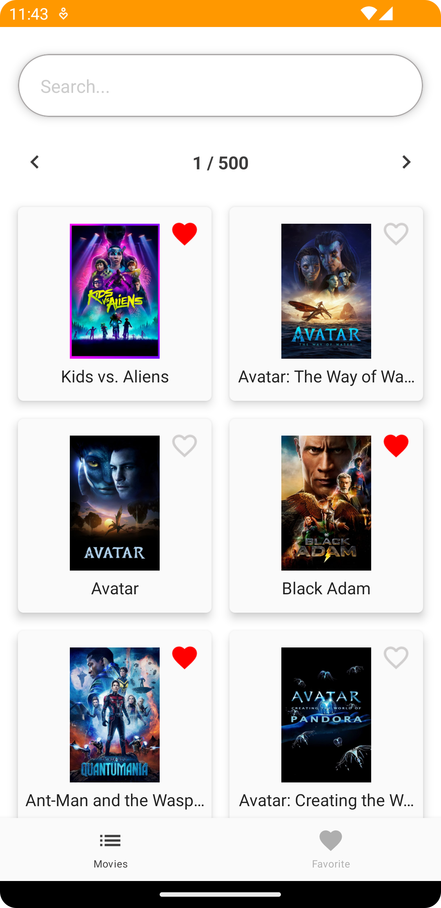
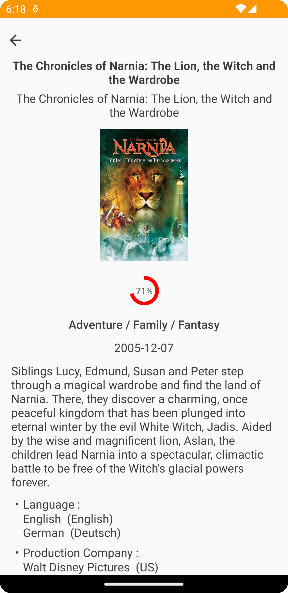

# MovieDB Compose
[Google Play Store](https://play.google.com/store/apps/details?id=levilin.moviedatabase)  
[Demo Video](https://youtu.be/fixcJBaKpcE)  
<table>
	<tr>
		<td>
			
		</td>
		<td>
			
		</td>
	</tr>
	<tr>
		<td>
			
		</td>
		<td>
			
		</td>
	</tr>
	<tr>
		<td>
			
		</td>
		<td>
			
		</td>
	</tr>
</table>

Coding Challenge

## Intro

A client has tasked us to build an app where their customers are able to search for movies, see details for a given movie, favorite that movie, see all favorited movies.  
The app will mainly use themoviedb.org's API and will put the media front and center for the user.

## Requirements

1) Make an API key following the steps here: https://developers.themoviedb.org/3/getting-started/introduction  
2) Film search (using this API endpoint **GET** https://api.themoviedb.org/3/search/movie?api_key={apikey}&query={search_query}), display the films in whatever UI you want.  
3) The user should be able to see details of the film (endpoint **GET** https://api.themoviedb.org/3/movie/{movie_id}?api_key={apikey})  
4) The user should be able to favorite and unfavorite a movie (use whatever local storage that you think make sense)  
5) The user should be able to see a list of favorite movies (and from there go to the detail movie screen)  

# Main Libraries Used
* Compose
* Coroutines
* Navigation
* Room
* Dagger Hilt
* Retrofit
* OkHttp3
* Gson
* Coil
* Junit

